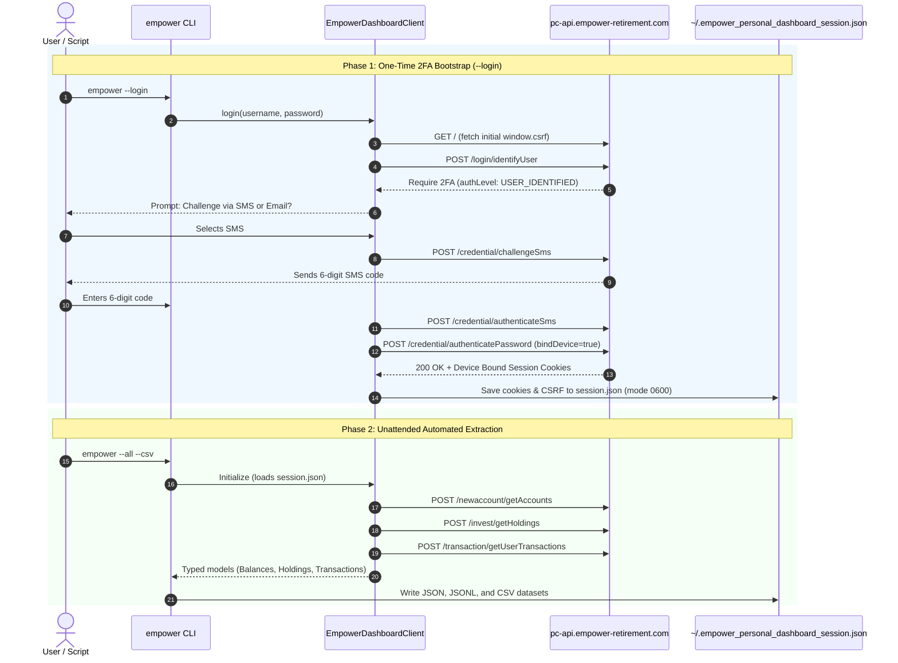

# Empower Personal Dashboard (`empower-personal-dashboard`)

[](https://github.com/petry-projects/empower-personal-dashboard/actions/workflows/ci.yml)
[](https://opensource.org/licenses/MIT)
[](https://www.python.org/downloads/)
[](CONTRIBUTING.md)
[](AGENTS.md#2-zero-pii--privacy-strict-mandate)

A standalone, modern Python client and CLI for **Empower Personal Dashboard** (formerly **Personal Capital**).

Empower Personal Dashboard aggregates linked financial institutions—including banking, checking, high-yield savings, credit cards, mortgages, 401(k) plans, traditional/Roth IRAs, 529 plans, and taxable brokerage accounts.

This library provides full programmatic and CLI access to:
* **Account Balances & Net Worth Totals**: Aggregate cash, investment, credit, mortgage, loan, and other asset balances.
* **Investment Holdings & Positions**: Security-level positions, quantities, market prices, cost basis, weights, and daily value changes across all investment accounts.
* **Account Transactions**: Multi-year transaction history with date-range filters, account filtering, category mapping, and reverse-chronological ordering.
* **Two-Phase Persistent Authentication**: One-time interactive 2FA setup (SMS or Email) with device binding, followed by completely unattended periodic runs.
* **Unified Migration Awareness**: Automatic detection and transparent routing for accounts migrated to Empower's unified API endpoint (`pc-api.empower-retirement.com`).
* **Text Sanitization**: Built-in stripping of Unicode replacement characters (`\ufffd`) often injected by upstream broker feeds.
* **Zero External Dependencies**: Pure Python built only on standard `requests`.

---

## Table of Contents

- [Installation](#installation)
- [Quickstart CLI](#quickstart-cli)
  - [1. One-Time Setup (2FA Authentication & Device Binding)](#1-one-time-setup-2fa-authentication--device-binding)
  - [2. Unattended Data Extraction](#2-unattended-data-extraction)
  - [3. Offline Sandbox Mode](#3-offline-sandbox-mode)
- [Python API Usage](#python-api-usage)
  - [Extract Balances & Net Worth](#extract-balances--net-worth)
  - [Extract Investment Holdings](#extract-investment-holdings)
  - [Extract Transactions](#extract-transactions)
- [Model Context Protocol (MCP) Server](#model-context-protocol-mcp-server)
  - [Installation with MCP Support](#installation-with-mcp-support)
  - [Configuration for AI Agents](#configuration-for-ai-agents)
  - [MCP Tools & Resources](#mcp-tools--resources)
- [Architecture & Authentication Lifecycle](#architecture--authentication-lifecycle)
- [Security & Privacy Model](#security--privacy-model)
- [Development & Testing](#development--testing)
- [Contributing & Agent Standards](#contributing--agent-standards)
- [License](#license)

---

## Installation

```bash
# Clone and install locally in editable mode
git clone https://github.com/petry-projects/empower-personal-dashboard.git
cd empower-personal-dashboard
pip install -e .
```

Or install directly from GitHub:
```bash
pip install git+https://github.com/petry-projects/empower-personal-dashboard.git
```

---

## Quickstart CLI

### 1. One-Time Setup (2FA Authentication & Device Binding)

Run the interactive setup to authenticate with your Empower credentials and complete the 2FA challenge:

```bash
empower --login
```

This binds the device and saves an authenticated session file to `~/.empower_personal_dashboard_session.json` with secure owner-only POSIX permissions (`0600`). Subsequent runs operate completely unattended without passwords or 2FA prompts.

### 2. Unattended Data Extraction

```bash
# Extract balances and display aligned table
empower

# Extract balances, holdings, and transactions with companion CSV exports
empower --all --csv

# Extract only investment holdings and positions
empower --holdings --limit 20

# Extract transactions for a specific date range
empower --transactions --start-date 2026-01-01 --end-date 2026-09-30 --limit 50

# Output in JSON or Markdown format
empower --format markdown
empower --all --format json
```

### 3. Offline Sandbox Mode

Test the CLI without entering credentials or making network requests:

```bash
empower --sandbox --all --csv
```

---

## Python API Usage

### Extract Balances & Net Worth

```python
from empower_personal_dashboard import EmpowerDashboardClient

# Automatically loads saved session from ~/.empower_personal_dashboard_session.json
client = EmpowerDashboardClient()

balances = client.fetch_balances()
print(f"Total Net Worth: ${balances.net_worth:,.2f}")
print(f"Total Investments: ${balances.total_investment:,.2f}")
print(f"Total Cash: ${balances.total_cash:,.2f}")

for acct in balances.accounts:
    print(f"  [{acct['account_type']}] {acct['firm_name']} - {acct['account_name']}: ${acct['balance']:,.2f}")
```

### Extract Investment Holdings

```python
holdings = client.fetch_holdings()
print(f"Total Portfolio Value: ${holdings.total_value:,.2f}")

for pos in holdings.holdings[:10]:
    ticker = pos.get('ticker') or 'N/A'
    print(f"  {ticker:<6} {pos['description']:<35} {pos['quantity']:>8.2f} shs @ ${pos['price']:>7.2f} = ${pos['value']:>10.2f}")
```

### Extract Transactions

```python
transactions = client.fetch_transactions(
    start_date="2026-01-01",
    end_date="2026-09-30",
    limit=50,
)
print(f"Total Transactions: {transactions.total_transactions}")
print(f"Net Cashflow: ${transactions.net_cashflow:,.2f}")

for tx in transactions.transactions[:10]:
    sign = "+" if tx["is_credit"] or tx["is_cash_in"] else "-"
    print(f"  {tx['transaction_date']} | {tx['account_name'][:20]:<20} | {tx['description'][:30]:<30} | {sign}${tx['amount']:,.2f}")
```

---

## Model Context Protocol (MCP) Server

Connect your Empower Personal Dashboard to AI agents (**Claude Desktop, Antigravity CLI, Cursor, Windsurf, Claude Code**) via the **Model Context Protocol (MCP)**.

### Installation with MCP Support

```bash
pip install "empower-personal-dashboard[mcp]"
```

Or run directly without installation via `uvx`:
```bash
uvx --from "empower-personal-dashboard[mcp]" empower-mcp
```

### Configuration for AI Agents

#### 1. Claude Desktop (`claude_desktop_config.json`)
```json
{
  "mcpServers": {
    "empower": {
      "command": "empower-mcp"
    }
  }
}
```

#### 2. Antigravity CLI / Cursor / VS Code (`mcp.json`)
```json
{
  "mcpServers": {
    "empower": {
      "command": "python3",
      "args": ["-m", "empower_personal_dashboard.mcp_server"]
    }
  }
}
```

### MCP Tools & Resources

| Tool | Parameters | Description |
| :--- | :--- | :--- |
| `get_net_worth_summary` | None | Ultra-lightweight summary (net worth, cash, investments, credit/debt, loans) minimizing LLM context (~100 tokens). |
| `get_balances` | `account_types`, `include_inactive` | Per-account balances grouped by type (`CASH`, `INVESTMENT`, `CREDIT`, etc.) with masked account numbers. |
| `get_holdings` | `ticker`, `account_id`, `limit` | Security-level positions, quantities, prices, cost basis, and percentage allocations. |
| `get_transactions` | `start_date`, `end_date`, `account_id`, `category`, `limit` | Historical transactions filtered by date range or category with pagination caps. |
| `check_auth_status` | None | Health check verifying that local session authentication is active. |

* **Resources:** `empower://balances/summary`, `empower://holdings/portfolio`, `empower://accounts/list`
* **Prompts:** `portfolio_review` (audits asset allocation and cash drag), `spending_audit` (analyzes monthly burn rate)

### Testing in Offline Sandbox Mode

Test the MCP server without credentials or network calls:
```bash
empower-mcp --sandbox
```

---

## Architecture & Authentication Lifecycle



---

## Security & Privacy Model

1. **Zero-PII Commitment**: All test suites, mock fixtures, and sample documentation use 100% synthetic financial records. Real user names, balances, account numbers, and transaction descriptions are never stored or committed.
2. **Owner-Only Session Storage**: Saved session tokens are written using atomic temporary files with restricted POSIX file permissions (`0600`).
3. **Secret Redaction**: When running in `--debug` mode or with logging enabled, passwords, pins, and 2FA verification codes are automatically masked (`***REDACTED***`).
4. **No Password Storage**: The client does not store your account password; it persists only the session cookies and CSRF token generated upon device binding.

---

## Development & Testing

```bash
# Clone the repository
git clone https://github.com/petry-projects/empower-personal-dashboard.git
cd empower-personal-dashboard

# Install in editable mode with development dependencies
pip install -e ".[dev]"

# Run unit tests (offline, deterministic)
PYTHONPATH=. python3 -m unittest discover tests

# Verify syntax and byte compilation
python3 -m compileall empower_personal_dashboard tests
```

---

## Contributing & Agent Standards

- **[CONTRIBUTING.md](CONTRIBUTING.md)**: Guidelines for opening issues, reporting API changes, coding conventions, and pull request workflows.
- **[AGENTS.md](AGENTS.md)**: Canonical development standards, Test-Driven Development (TDD) rules, and security guidelines for AI coding agents (extending [`petry-projects/.github/AGENTS.md`](https://github.com/petry-projects/.github/blob/main/AGENTS.md)).
- **[CLAUDE.md](CLAUDE.md)**: Agent instructions for Claude Code.

---

## License

This project is licensed under the terms of the [MIT License](LICENSE).
