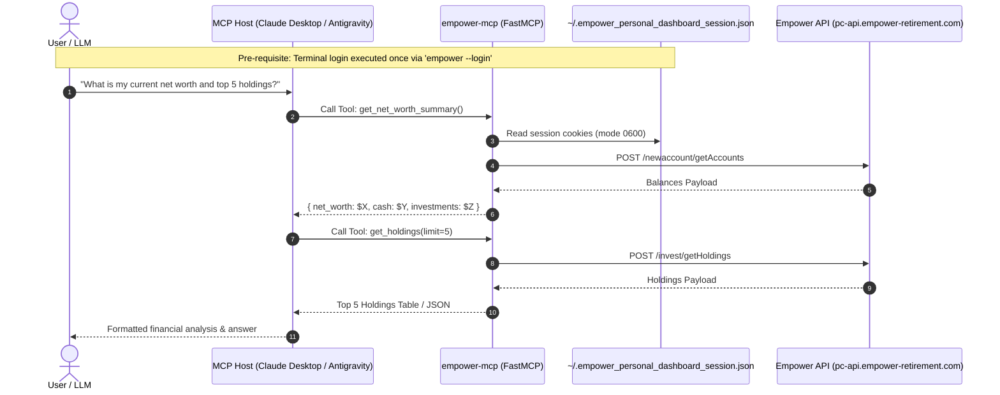

# ADR-0001: Model Context Protocol (MCP) Server Architecture & Implementation

- **Status:** Accepted
- **Date:** 2026-09-30
- **Deciders:** Don Petry
- **Consulted:** Antigravity AI, open-source community architectural precedents
- **Informed:** Contributors, agentic runtime integrators

---

## 1. Context & Problem Statement

Users of **Empower Personal Dashboard** (formerly Personal Capital) require automated, programmatic access to their aggregated financial data—including account balances, asset-class allocations, investment holdings, and historical transactions. With the rise of agentic coding environments and personal AI assistants (Claude Desktop, Antigravity CLI, Cursor, Windsurf, Claude Code), there is significant demand to expose this data via Anthropic's **Model Context Protocol (MCP)**.

However, financial aggregators present unique technical and security challenges:
1. **Interactive Multi-Factor Authentication (2FA):** Empower requires interactive two-factor SMS/Email verification and device binding. Routing interactive authentication loops or raw credentials through an LLM tool-calling context creates severe prompt-injection risks and credential-exfiltration vulnerabilities.
2. **Vendor Ecosystem Constraints:** Retail financial platforms prioritize consumer web portals and wealth management advisory sales over public developer APIs. A multi-tenant, hosted cloud MCP server (e.g. for consumer web Gemini Gems or Claude.ai web) is legally and operationally unfeasible without an official vendor-managed OAuth2 infrastructure.
3. **Context Window Limits:** Financial institution feeds can return megabytes of historical transaction records and hundreds of position lots, risking context overflow and degraded model reasoning if uncurated.

We need a standardized architectural pattern for exposing Empower data via MCP while guaranteeing absolute user data privacy, security, and developer ergonomics.

---

## 2. Decision Outcome

We decided to implement **Option 1: Co-located Native FastMCP Server with Out-of-Band Authentication**:

1. **Native Python FastMCP Integration:**
   Implement the MCP server directly within `empower-personal-dashboard` using the official Python MCP SDK (`from mcp.server.fastmcp import FastMCP`).
2. **Optional Extra Packaging:**
   Package MCP dependencies under an optional extra (`pip install "empower-personal-dashboard[mcp]"`), maintaining the core library's lean dependency footprint (`requests` only) for non-MCP users.
3. **Out-of-Band Authentication, In-Band Consumption:**
   - **Authentication (Out-of-Band):** The user performs the initial interactive login and 2FA challenge via the standard terminal CLI (`empower --login`). This binds the device and writes session cookies and CSRF tokens to `~/.empower_personal_dashboard_session.json` with POSIX `0600` permissions.
   - **Consumption (In-Band):** The MCP server runs headlessly, consuming the existing session file. If the session is missing or expired, tools fail fast with structured error responses instructing the user to re-authenticate via the terminal. Passwords and 2FA verification codes are **never** routed through the LLM context.
4. **Dual Transport Support (`stdio` + `sse`):**
   - **`stdio` (Default):** Zero-overhead local subprocess execution for desktop agent runtimes (Claude Desktop, Antigravity CLI, Cursor, Windsurf).
   - **`sse` (Networked):** Built-in Server-Sent Events HTTP server for self-hosted container environments (e.g. home NAS, local server behind Tailscale Funnel / Cloudflare Tunnel).

---

## 3. Architecture & Interface Design

### Sequence Flow

### Core MCP Tools Specification

| Tool Name | Parameters | Return Schema | Purpose |
| :--- | :--- | :--- | :--- |
| `get_net_worth_summary` | None | `{ net_worth, total_cash, total_investment, total_credit, total_mortgage, total_loan }` | Lightweight summary (~100 tokens) minimizing context consumption. |
| `get_balances` | `account_types: list[str] = None` `include_inactive: bool = False` | `{ accounts: [...], totals_by_type: {...} }` | Full per-account balance breakdown with masked account numbers. |
| `get_holdings` | `ticker: str = None` `account_id: int = None` `limit: int = 50` | `{ total_value, holdings: [...], count }` | Security positions with quantity, price, cost basis, and percentage weight. |
| `get_transactions` | `start_date: str = None` `end_date: str = None` `account_id: int = None` `category: str = None` `limit: int = 50` | `{ total_transactions, net_cashflow, transactions: [...] }` | Filtered transaction history with pagination guardrails. |
| `check_auth_status` | None | `{ authenticated: bool, username: str, expires_estimate: str }` | Healthcheck tool allowing agents to verify session viability before planning. |

### MCP Resources & Prompts

* **Resources:**
  - `empower://balances/summary` (Dynamic application state snapshot)
  - `empower://holdings/portfolio` (Current portfolio asset allocation)
  - `empower://accounts/list` (Linked institution metadata)
* **Prompts:**
  - `portfolio_review`: Pre-engineered analysis for asset allocation, drift, and cash drag.
  - `spending_audit`: Structured cashflow audit analyzing monthly burn and recurring subscriptions.

---

## 4. Alternatives Considered

### Alternative A: Standalone Repository (`mcp-server-empower`)
* **Description:** Separate repo importing `empower-personal-dashboard` from PyPI.
* **Why Rejected:** Introduces dual-repo release synchronization overhead, duplicate CI/CD pipelines, and version drift whenever Empower API quirks require client updates. Co-locating in the core repo provides a single source of truth.

### Alternative B: CLI Subprocess Wrapper
* **Description:** Wrapper script executing `empower --all --format json` on each invocation.
* **Why Rejected:** Incurs high latency (spawning a full Python runtime per tool call), relies on brittle text/stdout parsing, and lacks support for MCP Resources and native type validation.

### Alternative C: Multi-Tenant Hosted SaaS MCP Server
* **Description:** Cloud-hosted server allowing public users to connect their Empower accounts in web interfaces (e.g. consumer Claude.ai or Gemini Gems).
* **Why Rejected:** Without official vendor OAuth APIs, a hosted multi-tenant service would require storing retail banking credentials or session cookies on a centralized server. This introduces massive regulatory (GLBA, SOC 2, CFPB 1033) and security liabilities. Local-first execution is the only ethically and legally sound approach for community reverse-engineered financial APIs.

---

## 5. Security & Privacy Guardrails

1. **Zero-PII Commitment:** All automated tests and mock engines must use 100% synthetic test fixtures. Real bank account numbers, balances, or user names must never enter git.
2. **Account Number Masking:** Tools return masked account numbers by default (e.g., `Chase Checking - 1234`) to prevent full account identifier leakage into conversation transcripts.
3. **In-Memory TTL Caching:** Implement a 5-minute TTL cache on balances and holdings to prevent aggressive LLM loops from triggering upstream rate limits or IP bans.
4. **Context Window Protection:** All transaction and holding queries enforce pagination caps (`default: 50`, `max: 200`).

---

## 6. Implementation Plan & Milestones

1. **Milestone 1:** Add `[project.optional-dependencies] mcp = ["mcp>=1.2.0"]` and `empower-mcp` console script to `pyproject.toml`.
2. **Milestone 2:** Implement `empower_personal_dashboard/mcp_server.py` with `FastMCP` tools, resources, and error handlers.
3. **Milestone 3:** Add comprehensive unit tests in `tests/test_mcp_server.py` using offline synthetic fixtures.
4. **Milestone 4:** Update documentation in `README.md`, `AGENTS.md`, and publish a release.
