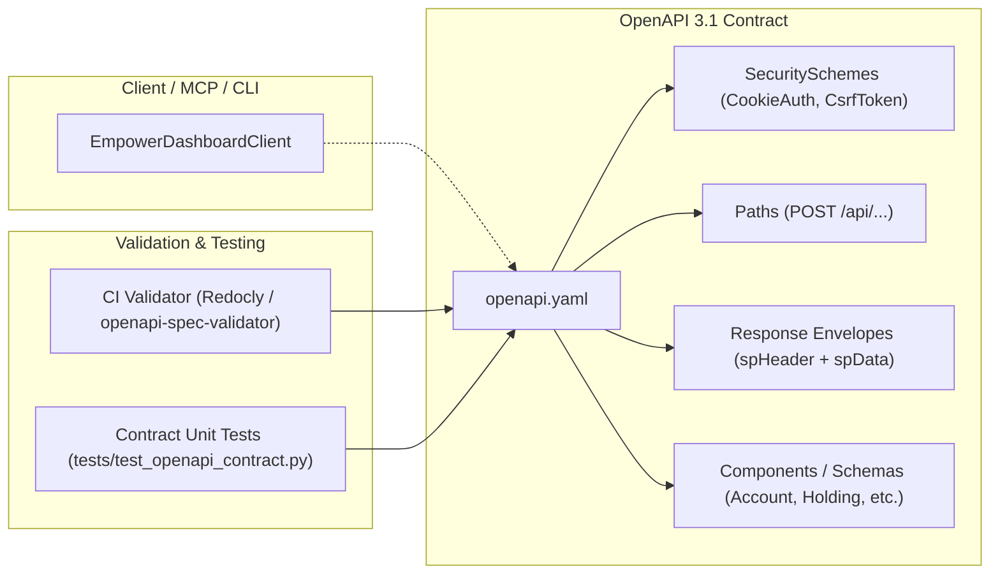

# ADR-0002: OpenAPI 3.1 Specification & Contract Testing Architecture

- **Status:** Proposed
- **Date:** 2026-10-01
- **Deciders:** Don Petry
- **Consulted:** Antigravity AI, open-source community architectural precedents
- **Informed:** Contributors, API consumers, agentic runtime integrators

---

## 1. Context & Problem Statement

`empower-personal-dashboard` provides programmatic access to aggregated financial accounts, balances, holdings, and transactions by reverse-engineering the private, undocumented RPC-over-HTTP web API of Empower Personal Dashboard (formerly Personal Capital).

Currently, all institutional knowledge regarding endpoint paths, query parameters, payload structures, session headers, and response envelopes resides exclusively in Python source code ([`client.py`](../../empower_personal_dashboard/client.py) and [`models.py`](../../empower_personal_dashboard/models.py)). While this is sufficient for internal execution, it presents several key engineering challenges:

1. **Lack of a Standardized Source of Truth:** External developers, contributors, and integrators have no formal contract describing the upstream wire protocol, HTTP verbs, required headers, or JSON envelopes.
2. **Upstream Schema Drift Risk:** Because Empower does not publish API documentation or change logs, upstream backend modifications (such as host migrations, field additions, or deprecated structures) can silently break client assumptions unless detected by formal contract tests.
3. **Redundant Schema Maintenance across CLI & MCP:** With the addition of the Model Context Protocol (MCP) server ([`mcp_server.py`](../../empower_personal_dashboard/mcp_server.py)), tool definitions and JSON Schemas must stay synchronized with Python dataclasses and upstream response shapes.
4. **Portability Barriers:** Developers wishing to consume or integrate Empower data in other languages (Go, TypeScript/Node.js, Rust, Home Assistant) must reverse-engineer the Python implementation from scratch rather than generating stubs from a machine-readable contract.

We need a standardized, open specification format to document the interface, serve as an authoritative contract, and support automated continuous validation in CI.

---

## 2. Decision Outcome

We decided to adopt **OpenAPI 3.1** as the formal interface specification format for `empower-personal-dashboard`, along with automated CI validation:

1. **OpenAPI 3.1 Standard:**
   - Adopt OpenAPI 3.1 (`openapi.yaml`) housed in `docs/openapi.yaml` (or repository root `openapi.yaml`).
   - OpenAPI 3.1 is 100% dialect-compatible with JSON Schema (Draft 2020-12), enabling direct alignment with FastMCP tool schemas in [`mcp_server.py`](../../empower_personal_dashboard/mcp_server.py) and typed dataclasses in [`models.py`](../../empower_personal_dashboard/models.py).

2. **Two-Tier Specification Scope:**
   - **Tier 1 (Upstream Wire RPC Specification):** Models the reverse-engineered HTTP POST endpoints (`/api/login/identifyUser`, `/api/login/authenticatePassword`, `/api/credential/challengeSms`, `/api/newaccount/getAccounts2`, `/api/invest/getHoldings`, `/api/transaction/getUserTransactions2`). Captures stateful cookie headers (`JSESSIONID`), CSRF tokens (`pm-csrf`), and the standardized Empower response envelope:
     ```json
     {
       "spHeader": {
         "success": true,
         "code": 0,
         "status": "OK"
       },
       "spData": { ... }
     }
     ```
   - **Tier 2 (Domain & Aggregation Schemas):** Defines canonical component schemas representing the clean, sanitized domain models ([`DashboardBalances`](../../empower_personal_dashboard/models.py), [`Holding`](../../empower_personal_dashboard/models.py), [`Transaction`](../../empower_personal_dashboard/models.py), [`NetWorthSummary`](../../empower_personal_dashboard/models.py)) exposed by the CLI and MCP server.

3. **Continuous OpenAPI Validation in CI:**
   - Integrate an automated OpenAPI 3.1 validator directly into GitHub Actions (`.github/workflows/ci.yml`).
   - Enforce zero validation errors or schema warnings on pull requests and pushes to `main`.
   - Add hermetic unit contract tests in `tests/test_openapi_contract.py` validating that synthetic test fixtures conform to the OpenAPI 3.1 specification.

4. **Zero-PII & Privacy Strict Compliance:**
   - All examples, synthetic mock responses, and documentation schemas in the OpenAPI specification MUST strictly follow the project's Zero-PII mandate. No real account numbers, user names, or credentials will be present.

---

## 3. Architecture & Schema Design

### RPC-over-HTTP Mapping Pattern

Empower's API operates as an RPC-over-HTTP protocol using HTTP POST operations:



### Key Endpoints Documented

| Endpoint Path | HTTP Verb | Purpose | Response Payload (`spData`) |
| :--- | :--- | :--- | :--- |
| `/api/login/identifyUser` | `POST` | Phase 1 authentication bootstrap and username lookup | `{ user: { username, ... } }` |
| `/api/login/authenticatePassword` | `POST` | Phase 1 password authentication & 2FA challenge trigger | `{ challengeSms: bool, ... }` |
| `/api/credential/challengeSms` | `POST` | Phase 1 SMS/Email 2FA verification code submission | `{ authenticated: bool, ... }` |
| `/api/newaccount/getAccounts2` | `POST` | Aggregated accounts, institutions, and balance figures | `{ accounts: [Account], ... }` |
| `/api/invest/getHoldings` | `POST` | Detailed investment portfolio positions & lots | `{ holdings: [Holding], ... }` |
| `/api/transaction/getUserTransactions2` | `POST` | Filtered and paginated transaction history | `{ transactions: [Transaction], ... }` |

---

## 4. Alternatives Considered

### Alternative A: Protocol Buffers (Protobuf) + Connect-RPC / Twirp
- **Description:** Define the RPC interface in `.proto` files and use Twirp or Connect to generate client code.
- **Why Rejected:** Upstream Empower already communicates via standard JSON-over-HTTP. Introducing Protobuf adds an artificial serialization layer and requires extra build tooling (`protoc`, `buf`). Furthermore, Protobuf schemas do not map as seamlessly to FastMCP tool definitions as OpenAPI 3.1's native JSON Schema.

### Alternative B: OpenRPC
- **Description:** Use OpenRPC (`open-rpc.org`), a JSON Schema-based specification for JSON-RPC 2.0.
- **Why Rejected:** OpenRPC is designed for single-endpoint dispatchers where requests pass `{"jsonrpc": "2.0", "method": "..."}`. Empower dispatches calls to distinct URL paths (`/api/newaccount/getAccounts2`, `/api/invest/getHoldings`), which matches the OpenAPI path-routing paradigm directly.

### Alternative C: Code-as-Spec (Current State)
- **Description:** Rely solely on Python dataclasses in `models.py` and method signatures in `client.py`.
- **Why Rejected:** Provides no machine-readable specification for non-Python consumers, cannot be validated by standard API linters in CI, and makes schema evolution difficult to diff across commits.

---

## 5. Continuous Validation Strategy

To prevent specification drift, the OpenAPI spec must be actively validated:

1. **Syntax & Meta-Schema Linting in CI:**
   - Execute an OpenAPI linter (e.g. `@redocly/cli` or Python `openapi-spec-validator`) during the CI workflow in `.github/workflows/ci.yml`.
   - Ensures the file is syntactically sound, adheres to OpenAPI 3.1 specifications, and has no broken `$ref` pointers.

2. **Offline Contract Verification Unit Tests:**
   - Implement `tests/test_openapi_contract.py` using synthetic test fixtures from `tests/test_client.py`.
   - Asserts that mock API payloads conform to the schemas defined in `openapi.yaml`.
   - Runs in under 1 second without network access, adhering to the project's hermetic testing guidelines.

---

## 6. Implementation Plan & Milestones

1. **Milestone 1 (Specification Definition):**
   - Author `openapi.yaml` documenting core authentication, accounts, holdings, and transactions endpoints and domain schemas with synthetic Zero-PII examples.
2. **Milestone 2 (CI Linting & Validation):**
   - Integrate an OpenAPI 3.1 validator step into `.github/workflows/ci.yml`.
3. **Milestone 3 (Contract Unit Tests):**
   - Add `tests/test_openapi_contract.py` validating synthetic mock fixtures against the OpenAPI schemas.
4. **Milestone 4 (Documentation & Tooling):**
   - Reference `openapi.yaml` in `README.md`, `AGENTS.md`, and provide instructions for generating clients and previewing via Swagger UI or Redocly.
