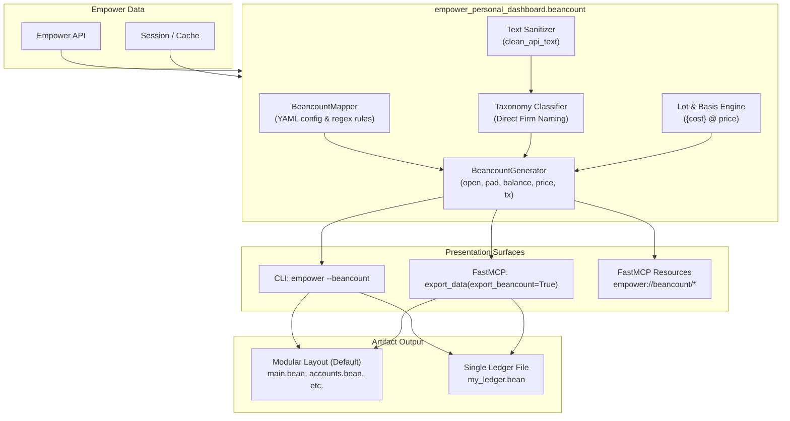

# ADR-0003: Beancount Plain-Text Accounting (PTA) Export Architecture

- **Status:** Accepted
- **Date:** 2026-10-01
- **Deciders:** Don Petry
- **Consulted:** Antigravity AI, Beancount community practices, Plain Text Accounting standards
- **Informed:** Contributors, agentic runtime integrators, end users

---

## 1. Context & Problem Statement

Users of **Empower Personal Dashboard** aggregate linked financial data from dozens of banking, credit card, loan, mortgage, and investment institutions. Many users manage personal finances using **Plain Text Accounting (PTA)** and [**Beancount**](https://github.com/beancount/beancount) with the [**Fava**](https://github.com/beancount/fava) web interface.

Historically, keeping a Beancount ledger synchronized across multiple financial institutions is error-prone and labor-intensive:
1. Users must write and maintain bespoke OFX/QFX/CSV importer scripts or web scrapers for each bank.
2. Changes to institutional portals frequently break downstream parsers.
3. Multi-currency, multi-asset portfolio pricing and commodity assertions must be manually entered or reconciled.

`empower-personal-dashboard` already provides a unified, sanitized, and deduplicated multi-institution feed. We need a native Beancount export format that generates 100% compliant Beancount ledger syntax while maintaining our core architectural standards:
* **Zero Heavy Dependencies:** Maintain a lightweight core library (`requests` only for core runtime).
* **Zero-PII Compliance:** Strictly synthetic test data and secret redaction.
* **Double-Entry Invariants:** Generate balanced transactions adhering to Beancount's accounting equation.
* **Developer & User Ergonomics:** Direct firm naming, modular default file organization, and YAML mapping configuration.

---

## 2. Decision Outcome

We decided to implement a **Pure-Python Native Beancount Export Engine** integrated into both the CLI and FastMCP server layers:

1. **Pure-Python Text Generation (Zero Heavy Dependencies):**
   - Directives (`open`, `close`, `pad`, `balance`, `price`, transactions) are generated using pure Python string formatting and strongly typed dataclasses.
   - The heavy C-extension `beancount` package is **not** a runtime dependency.
   - Directives conform strictly to the Beancount plain-text accounting grammar and work seamlessly with external Beancount CLI tools (e.g., `bean-check`, `fava`) without requiring Beancount as a Python dependency.

2. **File Layout Strategy (Modular Default with Existing Ledger Support):**
   - **Existing Ledgers:** Users can export or append directly to an existing single file via `--output-beancount <path>`.
   - **New Exports (Modular Default):** When targeting an export directory (e.g., `empower --all --beancount --output-beancount ./ledger/`), the exporter generates a clean modular ledger linked by Beancount `include` directives:
     - `main.bean`: Operating currency (`USD`), ledger title, and includes.
     - `accounts.bean`: `open` and `pad` directives for accounts and equity.
     - `balances.bean`: Ground-truth `balance` assertions for cash and commodities.
     - `holdings.bean`: Portfolio holdings with lot cost-basis and commodity positions.
     - `prices.bean`: Commodity `price` directives from portfolio holdings.
     - `transactions.bean`: Double-entry transactions with stable deduplication tags.

3. **Account Taxonomy & Direct Firm Naming:**
   - Account hierarchies use **Direct Firm Naming** without geographic prefixes (`US:`):
     - `Assets:Ally:Checking`
     - `Assets:Vanguard:TaxableBrokerage`
     - `Liabilities:Chase:SapphireReserve`
     - `Liabilities:RocketMortgage:PrimaryResidence`
   - Account names are normalized via `clean_api_text()` and validated against Beancount's account regex (`^(Assets|Liabilities|Equity|Income|Expenses):[A-Z0-9][A-Za-z0-9\-]*(:[A-Z0-9][A-Za-z0-9\-]*)*$`).

4. **YAML Account & Category Mapping:**
   - Supports user-defined YAML mapping files (`~/.empower_beancount_map.yaml` or `--beancount-map <path>`):
     - `accounts`: Aliases from Empower accounts to custom Beancount accounts.
     - `categories`: Maps Empower categories to specific `Expenses:*` or `Income:*` accounts.
     - `regex_rules`: Regular expression matching on transaction payees/descriptions.
   - Unmapped transactions fall back cleanly to `Expenses:Uncategorized`, `Income:Uncategorized`, or `Equity:Transfers`.

5. **Investment Holdings & Lot Tracking:**
   - Generates daily `price` directives for all tracked commodities/tickers.
   - Emits native Beancount lot syntax (`{cost_basis CURRENCY} @ price CURRENCY`) whenever lot cost basis is available from Empower portfolio snapshots.

6. **Stable Deduplication:**
   - Emits Empower's immutable `user_transaction_id` as Beancount transaction metadata (`empower_id`) and link (`^empower-tx-<id>`).

---

## 3. Architecture & Component Interaction

---

## 4. Consequences & Trade-offs

### Positive
- **Zero Runtime Bloat:** Emits compliant Beancount plain text without compiling C extensions or requiring `beancount` installed in user environments.
- **Idempotent Automated Sync:** Stable transaction IDs enable repeated headless exports via cron or MCP without ledger duplication.
- **Extensible Configuration:** Users have complete control over account hierarchies and category assignments via intuitive YAML configuration.
- **Standard Tooling Compatibility:** Exported files work out-of-the-box with `bean-check`, `bean-report`, and Fava.

### Trade-offs & Mitigations
- **Single-Leg Upstream Feed:** Upstream financial institutions only provide the account leg of a transaction.
  - *Mitigation:* Rule-based YAML mapper and sensible fallback accounts (`Expenses:Uncategorized`, `Equity:Transfers`) ensure all transactions balance to zero.
- **YAML Parser Availability:**
  - *Mitigation:* Uses `PyYAML` if present; gracefully falls back to basic built-in parsing or JSON mappings if PyYAML is absent, ensuring zero hard runtime breakage.

---

## 5. Verification & Testing Strategy

- **Hermetic TDD:** Unit tests in `tests/test_beancount.py` verifying directive formatting, direct firm account slugification, YAML rule mapping, lot tracking, and modular file layout.
- **100% Synthetic Data:** All test fixtures adhere to the Zero-PII strict mandate from [`AGENTS.md`](../../AGENTS.md).
- **Fast Execution:** All Beancount tests execute in under 1 second without network I/O.
- **Syntax Compliance:** Verify generated output against standard Beancount BNF grammar rules.
